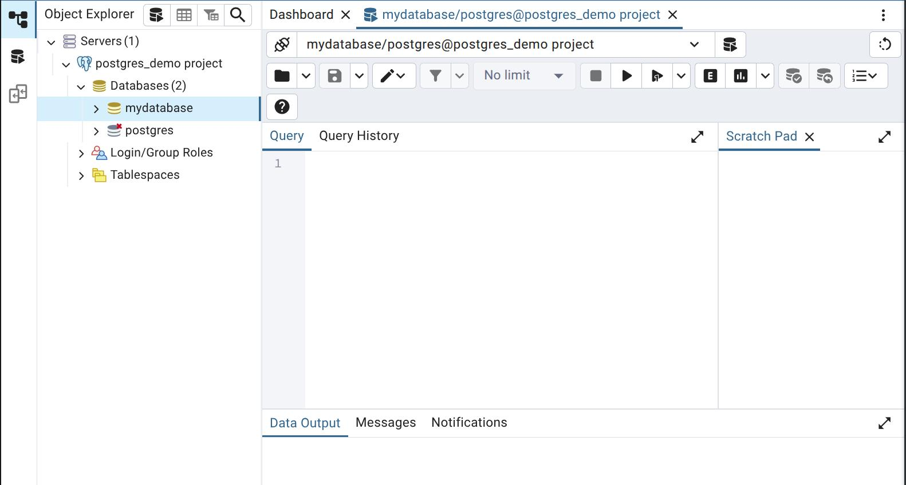

# PostgreSQL Demo

PostgreSQLの基本操作と全文検索システムを学習するためのプロジェクトです。
DockerコンテナとPythonを使用して、データベース操作の実践的な学習ができます。

## クイックスタート

### 1. 起動

    ```bash
    ./start.sh
    ```

### 2. 終了

    ```bash
    ./stop.sh
    ```

## python コンテナから db へ接続テスト

  - テーブルの作成デモ

    ```console
    $ docker exec -it python_postgres_demo /bin/bash
    myuser@python_postgres_demo:/app$ python src/apps/task_demo.py 
    Connected to database: DatabaseConfig(host=db, port=5432, database=mydatabase, user=postgres)
    === Task Management Demo ===

    1. Creating tasks...
    Task created successfully with ID: 1
    Task created successfully with ID: 2

    2. Reading all tasks...
    ID: 2, Title: Dockerの理解, Status: pending
    ID: 1, Title: PostgreSQLの学習, Status: pending

    3. Updating task 1...
    Task 1 updated successfully

    4. Reading updated task...
    Updated task - ID: 1, Title: PostgreSQLの学習, Status: in_progress

    Demo completed successfully!
    ```
    
  - Publicなテーブルをすべて表示
    
    ```console
    myuser@python_postgres_demo:/app$ python src/apps/connection_test.py 
    Connecting to database: DatabaseConfig(host=db, port=5432, database=mydatabase, user=postgres)
    Connected to PostgreSQL successfully!

    Public Tables in database:
    Table: tasks

    Connection closed.
    myuser@python_postgres_demo:/app$ 
    ```


## ホストから psql を使う

### 接続

    ```bash
    psql -h localhost -p 5555 -U postgres -d mydatabase
    ```

  - -h localhost: ホスト名
  - -p 5555: ホスト側に開かれているポート
  - -U username: ユーザー名（実際のユーザー名に置き換える）`POSTGRES_USER`
  - -d database_name: データベース名（実際のDB名に置き換える）`POSTGRES_DB`
  
  パスワードを尋ねられるので、`POSTGRES_PASSWORD` を入力.

### クエリ実行例

    ```console
    mydatabase=# SELECT table_name 
    FROM information_schema.tables 
    WHERE table_schema = 'public' 
    AND table_type = 'BASE TABLE';
     table_name 
    ------------
     tasks
    (1 row)

    mydatabase=# SELECT * from tasks;
     id |      title       |        description         |   status    |         created_at         |         updated_at         
    ----+------------------+----------------------------+-------------+----------------------------+----------------------------
      2 | Dockerの理解     | コンテナ技術の基礎を学ぶ   | pending     | 2025-08-22 05:42:04.289251 | 2025-08-22 05:42:04.289251
      1 | PostgreSQLの学習 | 基本的なCRUD操作を実装する | in_progress | 2025-08-22 05:42:04.28822  | 2025-08-22 05:42:04.289956
    (2 rows)
    ```

## pgAdmin コンテナを使う

- `localhost:8080` にアクセス
- ログイン

  

  - Email Address: `.env` で設定した `PGADMIN_EMAIL`
  - Password: `.env` で設定した `PGADMIN_PASSWORD`

- New server
  - General

    
  
    - Name: 適当な名称

  - Connection

    
    
    - Host name/address: コンテナ名 `db`
    - Port: コンテナ側　`db` のポート `5432`
    - Maintenance database: `POSTGRES_DB`
    - Username: `POSTGRES_USER`
    - Password: `POSTGRES_PASSWORD`
    
  上記を設定して `Save`.
  
- Query Tool

  `mydatabase (POSTGRES_DB)` から Query Tool を開く

  