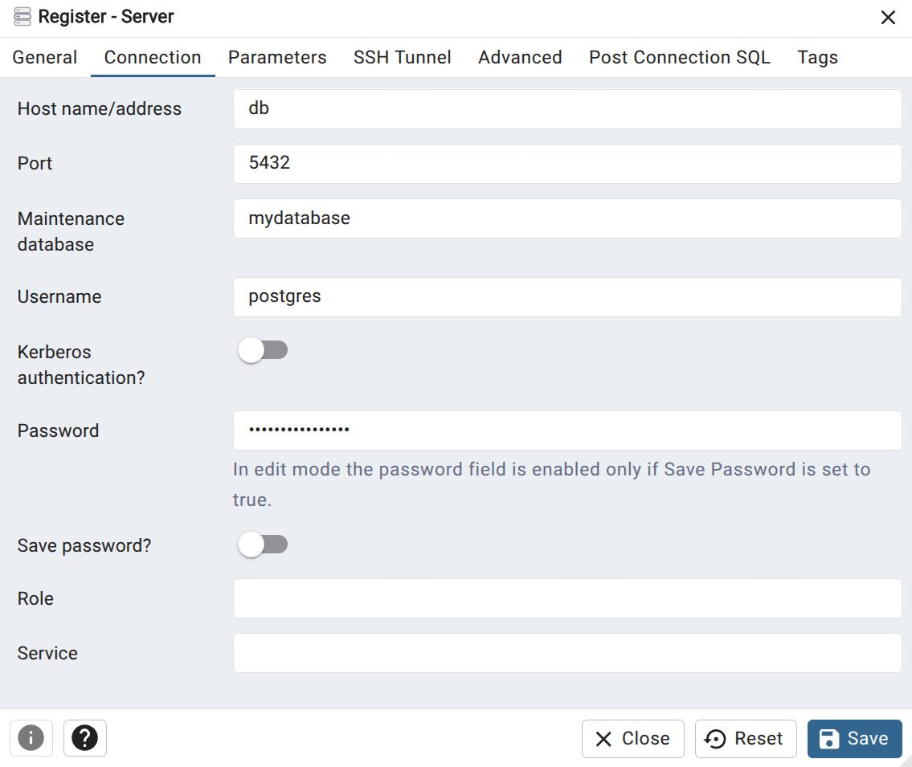

# pgAdminを使用したGUIデータベース操作

## 概要

pgAdminはPostgreSQLの公式Webベース管理ツールです。ブラウザからGUIでデータベースの操作、クエリ実行、テーブルの確認などが行えます。このプロジェクトではDockerコンテナとして提供されています。

## アクセス方法

### 1. ブラウザでアクセス

```
http://localhost:8080
```

**注意**: ポート番号は `.env` ファイルの `PGADMIN_PORT` 設定で変更可能です（デフォルト: 8080）。

### 2. ログイン


**ログイン情報**:
- **Email Address**: `.env`ファイルの`PGADMIN_EMAIL`で設定した値
- **Password**: `.env`ファイルの`PGADMIN_PASSWORD`で設定した値

**デフォルト値** (`.env`ファイル参照):
- Email: `admin@example.com`
- Password: `admin123`

## サーバー接続設定

### 1. 新しいサーバーを追加

ログイン後、左側のパネルで「Add New Server」をクリックするか、サーバーツリーを右クリックして「Create > Server...」を選択します。

### 2. General タブ設定


- **Name**: 適当なサーバー名（例: `PostgreSQL Demo`、`localhost`など）

### 3. Connection タブ設定



**接続情報**:
- **Host name/address**: `db`（Dockerコンテナ名）
- **Port**: `5432`（コンテナ内のPostgreSQLポート）
- **Maintenance database**: `.env`ファイルの`POSTGRES_DB`（デフォルト: `mydatabase`）
- **Username**: `.env`ファイルの`POSTGRES_USER`（デフォルト: `postgres`）
- **Password**: `.env`ファイルの`POSTGRES_PASSWORD`（デフォルト: `mysecretpassword`）

### 4. 接続の保存

設定完了後、「Save」をクリックして接続を保存します。

## 基本的な使用方法

### 1. データベースの確認

左側のツリーナビゲーションから以下の順でたどります：
```
Servers > [サーバー名] > Databases > mydatabase > Schemas > public > Tables
```

### 2. Query Tool の使用


**Query Toolを開く方法**:
1. データベース名（`mydatabase`）を右クリック
2. 「Query Tool」を選択

**または**:
1. 上部ツールバーの「Query Tool」アイコンをクリック

### 3. SQLクエリの実行

Query Tool画面で以下の操作が可能です：

```sql
-- テーブル一覧の表示
SELECT table_name 
FROM information_schema.tables 
WHERE table_schema = 'public';

-- データの確認
SELECT * FROM tasks;

-- pg_bigm拡張の確認（江戸料理デモ実行後）
SELECT extname, extversion FROM pg_extension;
```

**実行方法**:
- **F5キー** または **再生ボタン（▶）** をクリック
- **Ctrl+Enter** で選択した部分のみ実行

## 便利な機能

### 1. テーブルデータの確認

**方法1: 右クリックメニュー**
1. テーブル名を右クリック
2. 「View/Edit Data > All Rows」を選択

**方法2: プロパティタブ**
1. テーブル名をクリック
2. 右パネルの「Properties」タブでテーブル情報確認
3. 「Statistics」タブでテーブル統計確認

### 2. テーブル構造の確認

1. テーブル名を展開
2. 「Columns」でカラム情報確認
3. 「Indexes」でインデックス情報確認
4. 「Constraints」で制約情報確認

### 3. クエリ結果のエクスポート

Query Tool実行後：
1. 結果グリッドの上部メニューから「Download」アイコンをクリック
2. CSV、JSON、HTMLなどの形式で出力可能

### 4. クエリの保存・管理

1. Query Toolで「File」メニュー > 「Save」
2. よく使うクエリを保存して再利用可能

## 江戸料理デモでの使用例

### 1. デモ実行前の確認

```sql
-- 現在のテーブル一覧
SELECT table_name FROM information_schema.tables WHERE table_schema = 'public';

-- インストール済み拡張
SELECT extname FROM pg_extension;
```

### 2. デモ実行中の監視

```sql
-- 江戸料理テーブルの確認
SELECT name, id FROM edo_recipes ORDER BY id LIMIT 10;

-- 材料データの確認
SELECT recipe_id, ingredient FROM recipe_ingredients WHERE recipe_id = 1;

-- インデックス使用状況の確認
SELECT indexname, tablename FROM pg_indexes WHERE tablename LIKE '%recipe%';
```

### 3. pg_bigm機能の確認

```sql
-- pg_bigm関数の一覧
SELECT proname FROM pg_proc WHERE proname LIKE '%bigm%';

-- 類似度検索のテスト
SELECT name, bigm_similarity(name, '卵') as similarity 
FROM edo_recipes 
WHERE name LIKE '%卵%'
ORDER BY similarity DESC;
```

## トラブルシューティング

### 接続エラー

**エラー**: `Unable to connect to server`

**解決方法**:
1. Dockerコンテナが起動していることを確認: `docker ps`
2. Host name/addressが`db`（コンテナ名）になっていることを確認
3. ポート番号が`5432`になっていることを確認

### 認証エラー

**エラー**: `FATAL: password authentication failed`

**解決方法**:
1. `.env`ファイルの認証情報を確認
2. Username、Passwordが正しく設定されているか確認
3. Maintenance databaseが存在するか確認

### pgAdminログインエラー

**エラー**: `Invalid login`

**解決方法**:
1. `.env`ファイルの`PGADMIN_EMAIL`、`PGADMIN_PASSWORD`を確認
2. ブラウザのキャッシュをクリア
3. Dockerコンテナを再起動: `./stop.sh && ./start.sh`

## 高度な使用方法

### 1. バックアップ・リストア

**バックアップ**:
1. データベースを右クリック > 「Backup...」
2. フォーマット、ファイル名を指定して実行

**リストア**:
1. データベースを右クリック > 「Restore...」
2. バックアップファイルを選択して実行

### 2. ユーザー・権限管理

1. `Login/Group Roles`からユーザー管理
2. データベース権限の設定・確認
3. テーブル単位でのアクセス制御

### 3. パフォーマンス監視

1. 「Dashboard」でサーバー状況監視
2. 実行計画の確認（`EXPLAIN ANALYZE`）
3. スロークエリの分析

### 4. 拡張機能管理

1. `Extensions`から拡張機能の有効化/無効化
2. pg_bigmなどの専用拡張の設定確認

## パフォーマンス向上のヒント

1. **インデックス使用確認**: `EXPLAIN ANALYZE`でクエリプランを確認
2. **統計情報更新**: 大量データ処理後は`ANALYZE`実行
3. **接続プール**: 複数セッション使用時は適切な接続管理
4. **クエリ最適化**: pgAdminの実行計画機能を活用

## 関連情報

- [pgAdmin公式ドキュメント](https://www.pgadmin.org/docs/)
- [コマンドライン操作（psql）](./psql_usage.md)
- [江戸料理デモでの検索機能](./edo_recipe_demo.md)